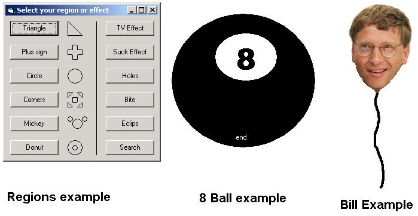

## Keep your forms in shape

### Description

Create custom shaped form. Triangle, circle, a form woth holes in it. If you can think of it, you can do it. You can even create a shape from a bitmap. Just look at the screenshot and you'l know what I mean.

Feedback and rates appriciated.
 
### More Info
 

             |
---                |---
**Submitted On**   |2001-04-23 13:33:04
**By**             |[Networking\.be](https://github.com/Planet-Source-Code/PSCIndex/blob/master/ByAuthor/networking-be.md)
**Level**          |Advanced
**User Rating**    |4.7 (52 globes from 11 users)
**Compatibility**  |VB 5\.0, VB 6\.0
**Category**       |[Windows API Call/ Explanation](https://github.com/Planet-Source-Code/PSCIndex/blob/master/ByCategory/windows-api-call-explanation__1-39.md)
**World**          |[Visual Basic](https://github.com/Planet-Source-Code/PSCIndex/blob/master/ByWorld/visual-basic.md)
**Archive File**   |[Keep your 187214232001\.zip](https://github.com/Planet-Source-Code/networking-be-keep-your-forms-in-shape__1-22627/archive/master.zip)

### Source Code

<EM>
    </EM>&nbsp;

<EM> On the 8th day,&nbsp;he
created win32 api, and saw it was good.</EM>  <EM>~Holy Bible, book of Cakkie,
chapter 1, vers 8</EM>

So we all know that we have API's, know we just need to know how to use
them.

I'm going to explain the region API's wich can give us the power to reshape
every window, or everything that has a window handle (like a picturebox).

<EM>- In the beginning there was nothing, as far as the eye can see, nothing,
nada, njet, rien, niets, nothing. - Sir, really nothing? ~Urbanus</EM>

Lets start with the begin. When we want to create regions, we have a variety
of API's to use. The most important are <STRONG>CreateRectRgn</STRONG>: creates
a rectangular region <STRONG>CreateRoundRectRgn</STRONG>: creates a rounded
rectangular region <STRONG>CreateEllipticRgn</STRONG>: creates a elliptical
region <STRONG>CreatePolygonRgn</STRONG>: create a region from an array of
points

The first&nbsp;3 (Rect, RoundRect and Elliptic) all take the same parameters.
The first 2 are the X and Y coordinates specifying the upper-left corner of the
region, the&nbsp;next 2 are the X and Y coordinates specifying the lower-right
corner or the region.

The CreatePolygonRgn takes following parameters The first is&nbsp;the
pointer to an array of the type POINTAPI The second is the number of points
in that array The last is the fillmode, which can be obtained by the
<STRONG>GetFillMode </STRONG>API

Once we created a region, we can use that to shape our form (or picturebox or
whatever, I'm only using forms here for breverity's sake) This is done by the
SetWindowRgn API, which takes the form's hWnd, the region and a boolean
specifying the form needs to be repainted.  Once that is done, the form
has the shape&nbsp;defined by the region.

<EM>- Is this the end? - No, it is&nbsp;just the beginning ~Arnold
Swarzenegger</EM>

Now we can have a form of almost any shape, but it doesn't end here. We can
also combine regions, what gives us the possibility to create even complexer
regions. This is done with the CombineRgn API. This function takes 4 parameters,
the first is the region wich will receive the result of the combine operation.
The second is the first region that needs to be combined, the third is the
second region to combine. The last parameter is the method we want to use to
combine. That can be one of the following: <STRONG>RGN_AND </STRONG>= 1 :
gives the region which is both in the first and the second
region <STRONG>RGN_COPY </STRONG>= 5 : copies the first
region <STRONG>RGN_DIFF </STRONG>= 4 : gives the regions which are in region1
but not in region2 <STRONG>RGN_OR </STRONG>= 2 : gives the regions which are
in region1 or in region2 <STRONG>RGN_XOR </STRONG>= 3 ; gives the regions
which are in region1 or in region2, but not in both

You must keep in mind that the receiving region already exists (by using the
CreateRectRgn for example).

You can also combine regions by using the <STRONG>CreatePolyPolygonRgn
</STRONG>function, which creates a region existing out several Polygon regions.
This way you can combine several Polygonregions in one call. However, I like
using the CombineRgn because it's simplicity.

<EM>This isn't Mission Difficult, this is Mission Impossible, Mission
Difficult should be a walk in the park for you ~Gene Hackman</EM>

<U>With this tutorial are 3 examples</U>. 

<STRONG>The region example </STRONG>shows the general use of the api's
described above. Just click one of the buttons and look what happens to
the&nbsp;form.

<STRONG>The 8ball example </STRONG>is a simple 'Magic 8 Ball' program, wich
really looks like an 8 ball. It also shows how to move a form when the titlebar
isn't visible. In order to get it working, you must shake the ball (that is move
the form around for a couple of seconds)

<STRONG>The Bill example </STRONG>is my favorite. It creates a region from a
bitmap. It gives a background color (in this case green) which will be left out
of the region. This way, you can get a form that is so odd-shaped it would take
hours to code it yourself. This also supports moving the form (which has no
border) and makes the form topmost. You will find out why I called it Bill the
second you run it.

<EM>What has become of this world? ~Beatrix (Final Fantasy IX)</EM>

&nbsp;

